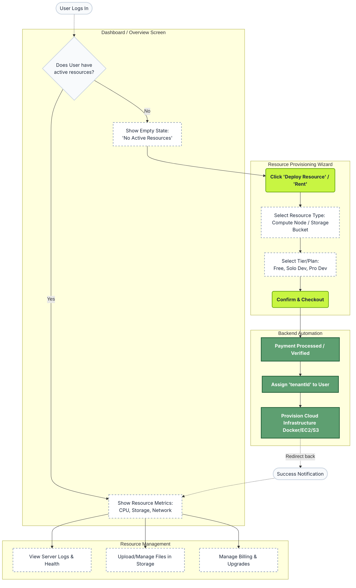

# User Dashboard & Resource Allocation Flow

Here is the flow of how a user will experience the platform after logging in, particularly focusing on renting and managing Storage and Compute (EC2) resources.

### Flow Breakdown for Profile/Dashboard:

1. **The Empty State (No Tenant ID yet)**: 
   When the user logs in for the first time, they don't have a `tenantId`. The dashboard should have a beautiful empty state (e.g., a "Create your first node" button, or "Deploy Storage" card) encouraging them to pick a plan from the landing page.
   
2. **The Provisioning Wizard**: 
   When they click "Rent" or "Create", they enter a step-by-step wizard. They select compute size, storage amount, region, etc. 

3. **Backend Magic**: 
   Once they checkout, your backend assigns them a `tenantId` (creating their isolated workspace) and starts spinning up the server/storage.

4. **The Active Dashboard (Tenant ID present)**: 
   Now, when they visit their dashboard, they see live metrics. You can show:
   - **Compute**: CPU usage, RAM usage, Uptime, Server IP, SSH Keys.
   - **Storage**: Total GB used, File Explorer, Access Keys.
   - **Billing**: Current cycle cost.
